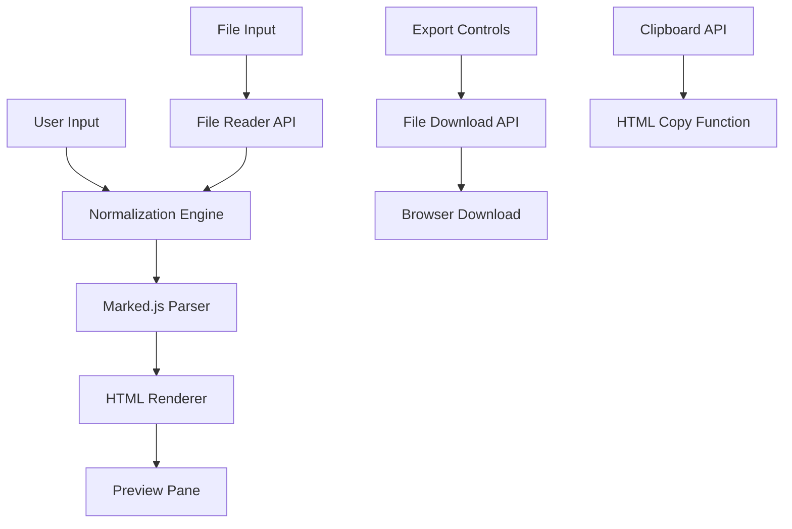

# Design Document

## Overview

JAMdown Pad is a client-side web application that provides seamless conversion between Japanese full-width Markdown notation and standard half-width Markdown. The application consists of a single HTML file with embedded CSS and JavaScript, designed for deployment as a static website on Amazon S3.

The core innovation is the real-time normalization engine that converts Japanese full-width symbols (＃, ＊, ＞, etc.) to their standard Markdown equivalents before rendering, allowing users to write naturally without switching input modes.

## Architecture

### High-Level Architecture



### Component Architecture

The application follows a modular JavaScript architecture with the following components:

1. **Normalization Engine** - Converts Japanese notation to standard Markdown
2. **Editor Controller** - Manages the textarea input and real-time updates
3. **Preview Controller** - Handles HTML rendering and display
4. **File Handler** - Manages file upload, conversion, and download
5. **Export Manager** - Handles .md download and HTML clipboard operations

## Components and Interfaces

### 1. Normalization Engine

**Purpose:** Core conversion logic for Japanese to standard Markdown notation

**Interface:**
```javascript
class NormalizationEngine {
  static normalize(text: string): string
  static getConversionRules(): Map<RegExp, string>
}
```

**Key Methods:**
- `normalize(text)` - Applies all conversion rules to input text
- `getConversionRules()` - Returns the mapping of Japanese patterns to standard Markdown

**Conversion Rules Implementation:**
```javascript
const CONVERSION_RULES = new Map([
  [/＃{1,6}/g, (match) => '#'.repeat(match.length)],
  [/＊＊([^＊]+)＊＊/g, '**$1**'],
  [/＊([^＊]+)＊/g, '*$1*'],
  [/＞/g, '>'],
  [/「([^」]+)」（([^）]+)）/g, '[$1]($2)'],
  [/｀｀｀/g, '```'],
  [/＊＊＊/g, '***'],
  [/ーーー/g, '---'],
  [/・/g, '* '],
  [/([０-９])．/g, (match, num) => convertFullWidthNumber(num) + '. ']
]);
```

### 2. Editor Controller

**Purpose:** Manages the main textarea input and triggers real-time updates

**Interface:**
```javascript
class EditorController {
  constructor(textareaElement: HTMLTextAreaElement)
  onInput(callback: (text: string) => void): void
  getText(): string
  setText(text: string): void
}
```

**Event Handling:**
- Listens for `input` events on the textarea
- Debounces rapid input to optimize performance
- Triggers normalization and preview updates

### 3. Preview Controller

**Purpose:** Renders normalized Markdown as HTML using marked.js

**Interface:**
```javascript
class PreviewController {
  constructor(previewElement: HTMLElement)
  render(markdownText: string): void
  getHTML(): string
}
```

**Rendering Pipeline:**
1. Receives normalized Markdown text
2. Passes to marked.js parser
3. Renders HTML in preview pane
4. Stores rendered HTML for export functions

### 4. File Handler

**Purpose:** Manages file upload, reading, and conversion

**Interface:**
```javascript
class FileHandler {
  constructor(fileInputElement: HTMLInputElement)
  onFileSelected(callback: (content: string) => void): void
  readFile(file: File): Promise<string>
}
```

**File Processing:**
- Supports .jamd and .md file extensions
- Uses FileReader API for client-side file reading
- Validates file types and handles errors gracefully

### 5. Export Manager

**Purpose:** Handles file downloads and clipboard operations

**Interface:**
```javascript
class ExportManager {
  downloadAsMarkdown(content: string, filename: string): void
  copyHTMLToClipboard(html: string): Promise<boolean>
}
```

**Export Functions:**
- Creates downloadable .md files with normalized content
- Uses Clipboard API for HTML copying
- Handles browser compatibility for download functionality

## Data Models

### Conversion Rule Model

```javascript
interface ConversionRule {
  pattern: RegExp;
  replacement: string | ((match: string, ...groups: string[]) => string);
  description: string;
}
```

### Application State Model

```javascript
interface AppState {
  currentText: string;
  normalizedText: string;
  renderedHTML: string;
  isProcessing: boolean;
}
```

### File Model

```javascript
interface FileData {
  name: string;
  content: string;
  type: 'jamd' | 'md';
  size: number;
}
```

## Error Handling

### Input Validation
- Validate file types before processing
- Handle empty or invalid file content gracefully
- Provide user feedback for unsupported operations

### Browser Compatibility
- Feature detection for Clipboard API
- Fallback methods for older browsers
- Progressive enhancement for modern features

### Error Recovery
- Graceful degradation when marked.js fails to load
- Error boundaries around conversion operations
- User-friendly error messages for common issues

## Testing Strategy

### Unit Testing
- **Normalization Engine Tests**
  - Test each conversion rule individually
  - Test complex mixed-notation scenarios
  - Test edge cases and malformed input

- **Component Tests**
  - Editor Controller input handling
  - Preview Controller rendering accuracy
  - File Handler file reading and validation
  - Export Manager download and clipboard functions

### Integration Testing
- **End-to-End Workflow Tests**
  - Complete typing → normalization → rendering flow
  - File upload → conversion → download flow
  - Mixed notation handling across all components

### Browser Testing
- **Cross-Browser Compatibility**
  - Chrome, Firefox, Safari, Edge
  - Mobile browser testing (iOS Safari, Chrome Mobile)
  - Feature detection and fallback testing

### Performance Testing
- **Real-time Performance**
  - Input lag measurement under various text sizes
  - Memory usage monitoring during extended use
  - Conversion speed benchmarking

## Deployment Architecture

### Static Website Structure
```
index.html (single file containing)
├── HTML structure
├── Embedded CSS styles
├── Embedded JavaScript application
└── CDN references
    └── marked.js (via jsDelivr or cdnjs)
```

### Amazon S3 Configuration
- **Bucket Setup**: Public read access for static website hosting
- **Index Document**: index.html
- **Error Document**: index.html (SPA behavior)
- **CORS Configuration**: Not required for static content

### CDN Integration
- **marked.js**: Load from reliable CDN (jsDelivr or cdnjs)
- **Fallback Strategy**: Include integrity checks and fallback URLs
- **Performance**: Leverage browser caching for CDN resources

### Security Considerations
- **Content Security Policy**: Restrict script sources to trusted CDNs
- **Input Sanitization**: Rely on marked.js built-in XSS protection
- **File Upload Security**: Client-side only, no server-side processing

## Performance Optimizations

### Real-time Processing
- **Debounced Input**: 150ms delay to reduce unnecessary processing
- **Incremental Updates**: Only re-render when content actually changes
- **Efficient Regex**: Optimized patterns for Japanese character conversion

### Memory Management
- **DOM Updates**: Minimize direct DOM manipulation
- **Event Cleanup**: Proper event listener management
- **Resource Cleanup**: Clear large text variables when not needed

### Loading Performance
- **Single File**: Eliminate additional HTTP requests
- **Minified Code**: Compress CSS and JavaScript
- **CDN Optimization**: Use minified versions of external libraries